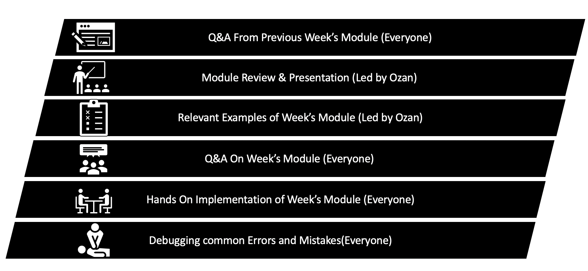

```{r setup, include=FALSE}
knitr::opts_chunk$set(echo = TRUE)
```

# What is it?

This workshop is designed to introduce participants to the {width=25px} programming language, focusing on key concepts and techniques required for data analysis, visualization and drawing insights from data. The workshop is divided into four one-hour sessions, covering topics such as the {width=25px} environment, {width=50px} interface, basic programming concepts, data manipulation, merging and joining data, summary statistics, and basic visualizations. The workshop aims to equip participants with the foundational skills needed to use {width=25px} effectively in their data analysis projects.

# Who should attend?

The workshop is suitable for individuals with little or no prior experience in programming or data analysis who are interested in learning how to use {width=25px} for data manipulation, data analysis, and visualization. This includes breeders, folks from testing team, and professionals from various fields who want to incorporate {width=25px} into their skillset. Prior knowledge of programming and/or statistics is helpful but not required, as the workshop will focus on the practical application of {width=25px} in data analysis.

# What will you learn?

By the end of the workshop, attendees will have a solid understanding of the {width=25px} programming environment and be able to:

* Install {width=25px} and {width=50px} and navigate the {width=50px} interface
* Understand {width=25px} syntax, data types, and data structures
* Perform basic operations with variables and use built-in functions
* Manipulate and transform data using dplyr and tidyr packages
* Import and export data from various formats, such as CSV and Excel
* Merge and join data using different types of joins
* Compute descriptive statistics and summary measures
* Create basic visualizations using ggplot2 package
* Customize plot aesthetics and add layers to plots
* Save and export plots in different formats

# Syllabus

| Week | Topic                     | Sections/Subsections                                         |
|------|---------------------------|---------------------------------------------------------------|
| 1    | Introduction to {width=25px}         | 1.1. What is {width=25px}?                                              |
|      |                           | 1.2. Why use {width=25px}?                                              |
|      |                           | 1.3. Installing {width=25px} and {width=50px}                                |
|      |                           | 1.4. {width=50px} interface                                       |
|      |                           | 1.5. {width=25px} packages and CRAN                                     |
| 1    | {width=25px} Basics                  | 2.1. {width=25px} syntax and data types                                 |
|      |                           | 2.2. Variables and assignment                                |
|      |                           | 2.3. Basic operations                                        |
|      |                           | 2.4. Vectors and data frames                                 |
|      |                           | 2.5. Indexing and subsetting                                 |
|      |                           | 2.6. Functions and control structures (if, for, while)       |
| 2    | Data Wrangling            | 3.1. Introduction to dplyr and tidyr                         |
|      |                           | 3.2. Importing data (CSV, Excel, and others)                 |
|      |                           | 3.3. Data cleaning and transformation                         |
|      |                           | 3.4. Piping with `%>%`                                       |
|      |                           | 3.5. Filtering and selecting data                             |
|      |                           | 3.6. Mutating and summarizing data                            |
|      |                           | 3.7. Grouping and ungrouping data                             |
|      |                           | 3.8. Reshaping data (wide to long, long to wide)              |
|3     | Data Merging and Joins    | 4.1. Introduction to data merging                             |
|      |                           | 4.2. Types of joins (inner, left, right, full)                |
|      |                           | 4.3. Merging data using dplyr (join functions)                |
|      |                           | 4.4. Handling missing values and duplicate rows                |
|4     | Summary Stat & Basic Visualizations      | 5.1. Descriptive statistics                                   |
|      |                           | 5.2. Frequency tables and cross-tabulations                   |
|      |                           | 5.3. Correlations and covariances                             |
|      |                           | 5.4. Using the summary() and describe() functions             |
|      |                           | 6.1. Introduction to ggplot2                                  |
|      |                           | 6.2. The grammar of graphics                                  |
|      |                           | 6.3. Creating basic plots (scatter, line, bar, histogram)     |
|      |                           | 6.4. Customizing plot aesthetics                              |
|      |                           | 6.5. Facets and plot layers                                   |
|      |                           | 6.6. Saving and exporting plots                               |
|5     | Wrap-up and Q&A           | 7.1. Recap of the workshop                                    |
|      |                           | 7.2. Resources for further learning                           |
|      |                           | 7.3. Open questions and clarifications                         |

# Structure

{width=125px}

# Some useful Resources

Here are some resources for beginners to continue learning {width=25px} after the workshop:

* R for Data Science (book) by Hadley Wickham and Garrett Grolemund: https://r4ds.had.co.nz/
DataCamp's Introduction to R (online course): https://www.datacamp.com/courses/free-introduction-to-r

* Coursera's Data Science Specialization (online course) by Johns Hopkins University: https://www.coursera.org/specializations/jhu-data-science

* The R Project for Statistical Computing: https://www.r-project.org/
R-bloggers: https://www.r-bloggers.com/

* Stack Overflow R community: https://stackoverflow.com/questions/tagged/r

These resources include books, online courses, tutorials, and community forums that will help participants deepen their understanding of R and apply it to their projects effectively